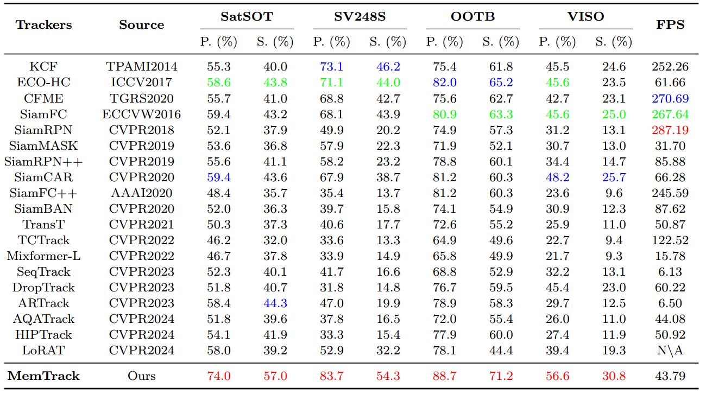

# 1. MemTrack:Utilizing the Temporal Memory Transformer Network for Satellite Video Object Tracking,
The code will be opened soon. The MemTrack framework is as follows:

Fig. 1. The overall framework of the proposed MemTrack.  <br>

Experimental results demonstrate the superior performance of our method. <br>

Table. 1. Performance comparison of trackers across different datasets. The best results are highlighted in red, the second-place with blue and the third-place with green.


# 2. Dataset preparation
The testing datasets are avalible in:[SatSOT](http://www.csu.cas.cn/gb/kybm/sjlyzx/gcxx_sjj/sjj_wxxl/202106/t20210607_6080256.html)，[SV248S](https://github.com/xdai-dlgvv/SV248S)，[OOTB](https://github.com/YZCU/OOTB) and [VISO](https://github.com/QingyongHu/VISO), which are all large public real satellite video datasets. Due to lack of offical json files (SV248S,OOTB and VISO), we create the specifical 'json files' for datasets and the corresponding 'dataset.py' files . <br>
The training dataset contains four commonly used datasets for general video object tracking in the field of computer vision, which can be easily obtained from the official websites of their respective datasets.

# 3. Install the environment
In this work, we use python=3.10 and torch==2.3.1+cu118 or torch==2.3.1+cu12.1. The specific installation packages are listed in conda_environment.yaml, which can be installed in the following way:
> Install the environment option1 torch==2.3.1+cu118
```python 
conda env create -f conda_environment.yml
```
Or manually create the Python environment, and then install other packages，which can be installed in the following way:
> Install the environment option2 torch==2.3.1+cu12.1
```python 
conda create -n MemTrack python=3.10
conda activate droptrack
pip install -r requirements.txt
```
## Set project paths
Run the following command to set paths for this project
> Set project paths
```python 
python tracking/create_default_local_file.py --workspace_dir . --data_dir ./data --save_dir ./output
```
After running this command, you can also modify paths by editing these two files
> Modify the paths
```python 
lib/train/admin/local.py  # paths about training
lib/test/evaluation/local.py  # paths about testing
```
