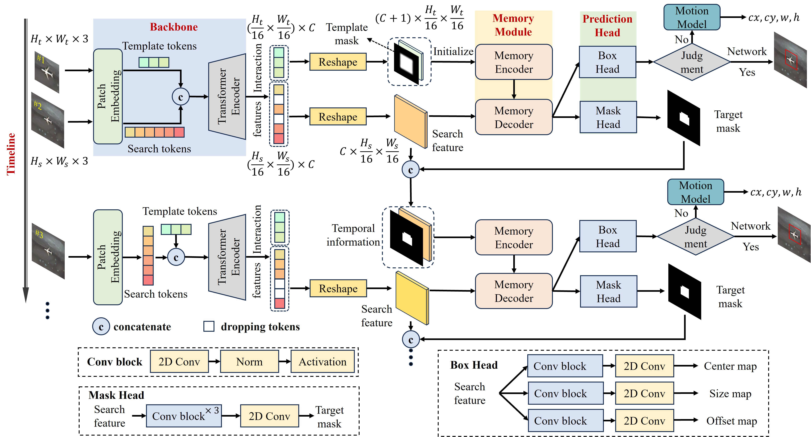

# 1. MemTrack:Utilizing the Temporal Memory Transformer Network for Satellite Video Object Tracking,
The code will be opened soon. The MemTrack framework is as follows:

Fig. 1. The overall framework of the proposed MemTrack.  

Experimental results demonstrate the superior performance of our method.  
Table. 1. Performance comparison of trackers across different datasets. The best results are highlighted in red, the second-place with blue and the third-place with green.

# 3. Dataset preparation
The testing datasets are avalible in:[SatSOT](http://www.csu.cas.cn/gb/kybm/sjlyzx/gcxx_sjj/sjj_wxxl/202106/t20210607_6080256.html)，[SV248S](https://github.com/xdai-dlgvv/SV248S)，[OOTB](https://github.com/YZCU/OOTB) and [VISO](https://github.com/QingyongHu/VISO), which are all large public real satellite video datasets.  
The training dataset contains four commonly used datasets for general video object tracking in the field of computer vision, which can be easily obtained from the official websites of their respective datasets.
